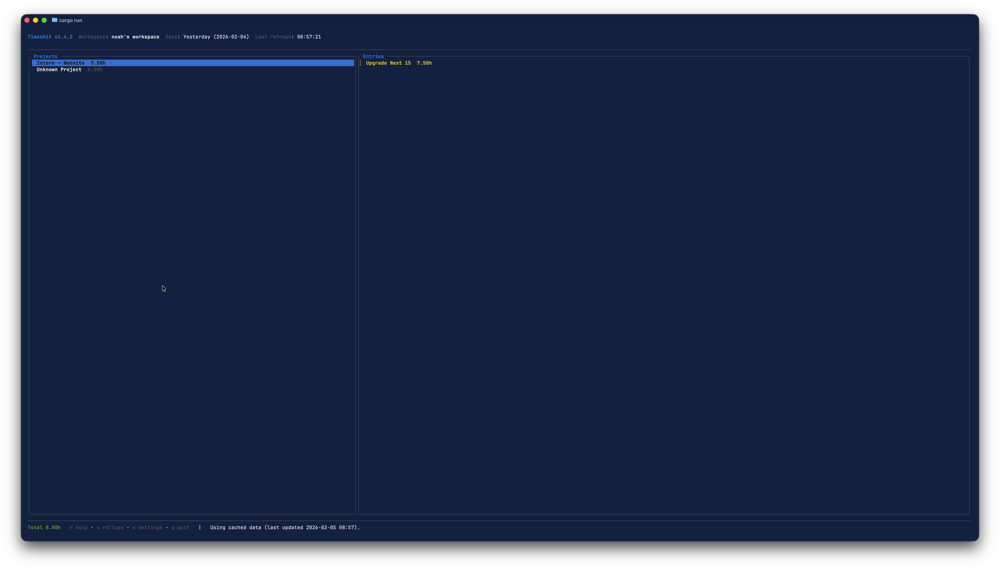
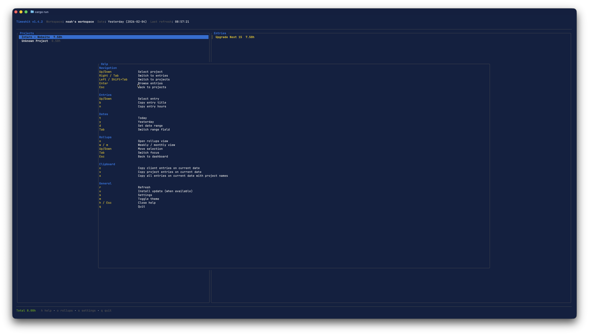
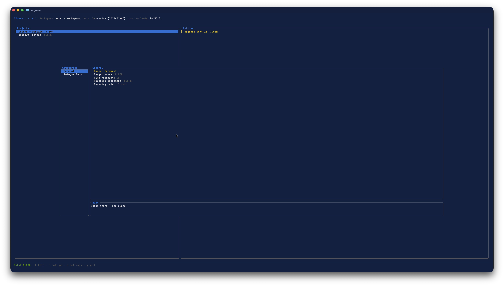
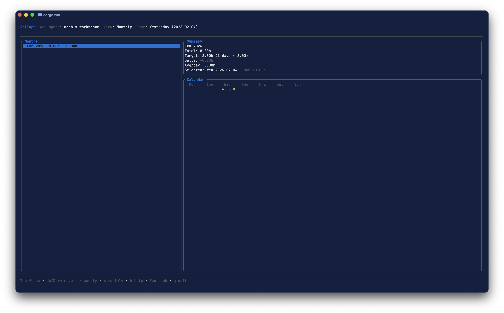

# Timeshit (Toggl2Timeshit)

Timeshit is a Rust-based Terminal UI (TUI) that turns Toggl Track time entries into a clean, navigable timesheet dashboard. It is optimized for free-tier API limits with a persistent cache and manual refresh.

## Highlights
- Modern TUI dashboard with grouped summaries and entry details
- Workspace selection and fast date range filtering
- Clipboard export for timesheet tools
- Cache-first design to reduce Toggl API usage
- Built-in settings (target hours, integrations, theme)

## Screenshots





## Installation

### macOS
**Homebrew (recommended)**
```bash
brew tap NoahNxT/nxt-solutions-packages
brew install timeshit
```
Upgrade:
```bash
brew upgrade timeshit
```
If you previously installed the legacy Node package, you may need to unlink it:
```bash
rm /opt/homebrew/bin/timeshit
brew link --overwrite timeshit
```
You can also remove the legacy global npm package:
```bash
npm remove -g toggl2timeshit
```

### Windows
**Chocolatey** (In Review)
```powershell
choco install timeshit
```
```powershell
choco install timeshit --version=1.3.6
```

**Scoop**
```powershell
scoop bucket add nxt-solutions https://github.com/NoahNxT/scoop-nxt-solutions-packages
scoop install timeshit
```

**Winget** (In Review)
```powershell
winget install NxTSolutions.Timeshit
```

### Linux
**APT (Debian/Ubuntu via Cloudsmith)**
```bash
curl -1sLf 'https://dl.cloudsmith.io/public/nxt-solutions/timeshit/setup.deb.sh' | sudo -E bash
sudo apt-get update
sudo apt-get install timeshit
```
If `timeshit` is not found after setup, verify the package is installed:
```bash
dpkg -s timeshit
which timeshit
```
If `timeshit` is installed but not in PATH, run it directly:
```bash
/usr/bin/timeshit
hash -r
```
If `apt` can’t find the package, force the distro/codename that matches your Cloudsmith publish target:
```bash
curl -1sLf 'https://dl.cloudsmith.io/public/nxt-solutions/timeshit/setup.deb.sh' \
  | sudo -E distro=ubuntu codename=noble bash
```

### GitHub Releases (any OS)
Download the latest asset from GitHub Releases and place it in your PATH.

Release assets:
- Linux: `timeshit-linux.tar.gz`
- macOS: `timeshit-macos.tar.gz`
- macOS PKG: `timeshit-macos.pkg`
- Windows: `timeshit-windows.zip`

### Build from Source
```bash
cargo build --release
```
Binary: `target/release/timeshit`

## Updates
- **GitHub Releases installs** use the in-app updater.
- **Package manager installs** should be updated via the package manager (brew/apt/choco/scoop/winget).

## Authentication
Use the in-app settings (Settings → Integrations) or set an environment variable:
```bash
export TOGGL_API_TOKEN="your-token"
```
Token file: `~/.toggl2tsc`

## Usage
```bash
timeshit
```

Date range selection is done inside the TUI (`d`).

## Keybinds (core)
- `h` help
- `c` copy client entries
- `v` copy project entries
- `x` copy entries with client + project
- `d` set date range
- `y` yesterday
- `[` / `]` previous / next active date range
- `r` refresh
- Arrow keys to navigate projects

## Keybinds (rollups)
- `o` open rollups
- `w` weekly view
- `m` monthly view
- `y` yearly view
- `Shift+R` refetch selected day/week/month/year
- `z` toggle weekends in rollups

## Docs
Full documentation lives in `docs/` and is published via GitHub Pages.

## Project
- Changelog: `CHANGELOG.md`
- Contributing: `CONTRIBUTING.md`
- Security: `SECURITY.md`

## License
MIT
**Direct download (PKG)**
Download `timeshit-macos.pkg` from GitHub Releases and run the installer.
