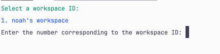

# Toggl2Timeshit

This is a simple tool to convert Toggl reports to a timesheet format.

## Usage

1. Install the package globally:

```bash
npm install -g toggl2timeshit
```

2. Authenticate with your Toggle API key:

> You can find it in your [Toggl Track Profile](https://track.toggl.com/profile).`

```bash
npx timeshit login
```

3. Run the command to generate the timesheet:

```bash
npx timeshit list
```

This will prompt you to select the workspace you want to generate the timesheet for.

Type the number of the workspace and press enter.



OUPUT:

```bash
Your current time entries:

Project A
+++++++++
Total hours today: 0.60

Tickets:
• Entry 1 name (0.27)
• Entry 2 name (0.33)

####################

Project B
+++++++++
Total hours today: 1.56

Tickets:
• Entry 1 name (0.61)
• Entry 2 name (0.61)
• Entry 3 name (0.34)

####################

Project C
+++++++++
Total hours today: 0.53

Tickets:
• Entry 1 name (0.53)

####################

=============================
Total hours today: 3.49
Total hours yesterday: 0.00
```
